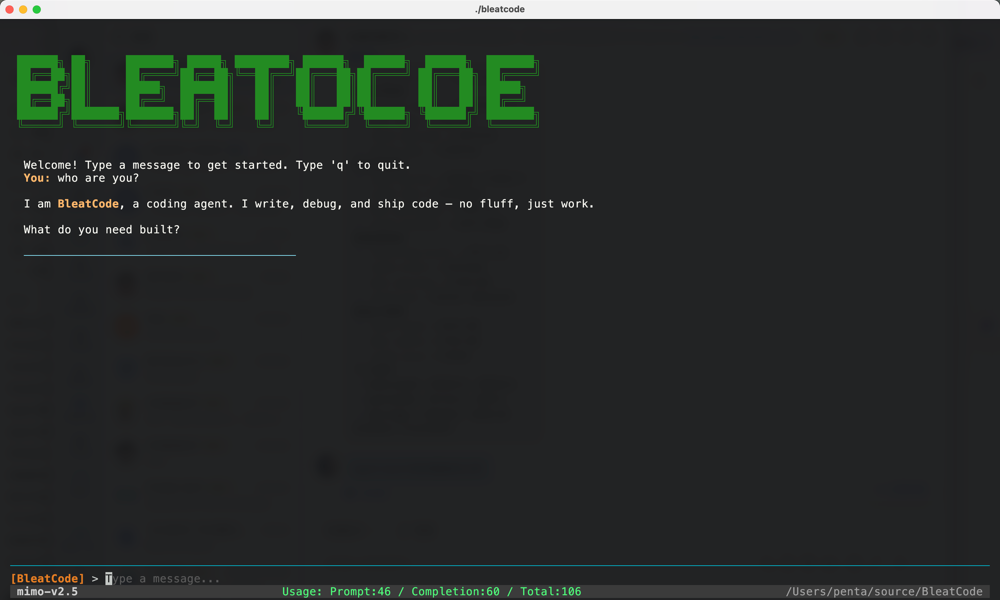

[中文](README.md)

# BleatCode

A terminal-based AI coding assistant written in Go, featuring an interactive TUI (Terminal User Interface) with real-time streaming Markdown output and multi-turn conversations.

## Screen Short



## Features

- **Real-time Streaming** — Token-by-token streaming with live Markdown rendering
- **Dracula-themed TUI** — Full-screen terminal UI built on Bubble Tea with Markdown rendering and syntax highlighting
- **Mouse Scroll** — Mouse wheel support for scrolling the output area
- **Multi-model Support** — Compatible with any OpenAI API-compatible service (OpenAI, Azure, local models, etc.)

## Quick Start

### Install

```bash
go install github.com/penta/BleatCode/cmd/bleatcode@latest
```

Or build from source:

```bash
git clone https://github.com/penta/BleatCode.git
cd BleatCode
go build -o bleatcode ./cmd/bleatcode/
```

### Configure

Copy the example config and fill in your API key:

```bash
cp config.yaml.example config.yaml
```

Edit `config.yaml`:

```yaml
model_select: "mimo"

models:
  mimo:
    api_key: "Your API Key"
    base_url: "https://token-plan-cn.xiaomimimo.com/v1"
    model_id: "mimo-v2.5"
```

You can also override settings via environment variables:

| Variable | Description |
|----------|-------------|
| `BLEATCODE_API_KEY` | Override API key |
| `BLEATCODE_BASE_URL` | Override API base URL |
| `BLEATCODE_MODEL_ID` | Override model ID |

### Run

```bash
bleatcode
# or specify a config file
bleatcode -c /path/to/config.yaml
```

## Key Bindings

| Key | Action |
|-----|--------|
| `Enter` | Send message |
| `q` / `exit` | Quit |
| `Ctrl+C` | Quit |
| `Alt+Up` / `Alt+Down` | Scroll line by line |
| `Ctrl+U` / `Ctrl+D` | Half-page scroll |
| `PgUp` / `PgDown` | Full-page scroll |

Mouse wheel can also be used to scroll the output area.

## Tech Stack

| Dependency | Purpose |
|------------|---------|
| [Bubble Tea](https://github.com/charmbracelet/bubbletea) | TUI framework (Elm architecture) |
| [Bubbles](https://github.com/charmbracelet/bubbles) | TUI components (text input, viewport) |
| [Glamour](https://github.com/charmbracelet/glamour) | Terminal Markdown rendering |
| [Lipgloss](https://github.com/charmbracelet/lipgloss) | Terminal styling and layout |
| [go-openai](https://github.com/sashabaranov/go-openai) | OpenAI-compatible API client |

## Project Structure

```
BleatCode/
  cmd/bleatcode/main.go         # Entry point
  internal/
    agent/
      loop.go                   # Agent loop (LLM streaming)
    config/
      config.go                 # YAML config loading + env var overrides
    tui/
      tui.go                    # TUI model (Update/View/Init)
      run.go                    # TUI bootstrap (logo, input, program launch)
  config.yaml.example           # Example config file
  go.mod
```

## License

MIT
