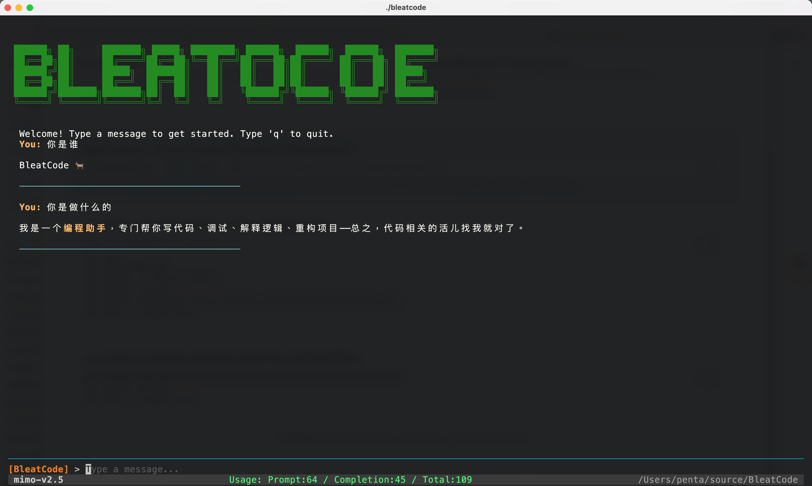

[English](README.en.md)

# BleatCode

一个基于 Go 语言的终端 AI 编程助手，提供交互式 TUI（终端用户界面），支持实时流式 Markdown 输出和多轮对话。

## 界面展示



## 功能特性

- **实时流式输出** — 模型响应逐 token 流式显示，Markdown 实时渲染
- **Dracula 主题 TUI** — 基于 Bubble Tea 的全屏终端界面，支持 Markdown 渲染和语法高亮
- **鼠标滚动** — 支持鼠标滚轮滚动输出区域
- **多模型支持** — 兼容所有 OpenAI API 格式的模型服务（OpenAI、Azure、本地模型等）

## 快速开始

### 安装

```bash
go install github.com/penta/BleatCode/cmd/bleatcode@latest
```

或从源码构建：

```bash
git clone https://github.com/penta/BleatCode.git
cd BleatCode
go build -o bleatcode ./cmd/bleatcode/
```

### 配置

复制示例配置文件并填入你的 API Key：

```bash
cp config.yaml.example config.yaml
```

编辑 `config.yaml`：

```yaml
model_select: "mimo"

models:
  mimo:
    api_key: "Your API Key"
    base_url: "https://token-plan-cn.xiaomimimo.com/v1"
    model_id: "mimo-v2.5"
```

也可以通过环境变量覆盖配置：

| 环境变量 | 说明 |
|---------|------|
| `BLEATCODE_API_KEY` | 覆盖 API Key |
| `BLEATCODE_BASE_URL` | 覆盖 API 地址 |
| `BLEATCODE_MODEL_ID` | 覆盖模型 ID |

### 运行

```bash
bleatcode
# 或指定配置文件
bleatcode -c /path/to/config.yaml
```

## 快捷键

| 按键 | 功能 |
|------|------|
| `Enter` | 发送消息 |
| `q` / `exit` | 退出 |
| `Ctrl+C` | 退出 |
| `Alt+Up` / `Alt+Down` | 逐行滚动 |
| `Ctrl+U` / `Ctrl+D` | 半页滚动 |
| `PgUp` / `PgDown` | 整页滚动 |

鼠标滚轮也可用于滚动输出区域。

## 技术栈

| 依赖 | 用途 |
|------|------|
| [Bubble Tea](https://github.com/charmbracelet/bubbletea) | TUI 框架（Elm 架构） |
| [Bubbles](https://github.com/charmbracelet/bubbles) | TUI 组件（输入框、视口） |
| [Glamour](https://github.com/charmbracelet/glamour) | 终端 Markdown 渲染 |
| [Lipgloss](https://github.com/charmbracelet/lipgloss) | 终端样式和布局 |
| [go-openai](https://github.com/sashabaranov/go-openai) | OpenAI 兼容 API 客户端 |

## 项目结构

```
BleatCode/
  cmd/bleatcode/main.go         # 程序入口
  internal/
    agent/
      loop.go                   # Agent 循环（LLM 流式调用）
    config/
      config.go                 # YAML 配置加载 + 环境变量覆盖
    tui/
      tui.go                    # TUI 模型（Update/View/Init）
      run.go                    # TUI 启动（Logo、输入框、程序初始化）
  config.yaml.example           # 配置文件示例
  go.mod
```

## License

MIT
